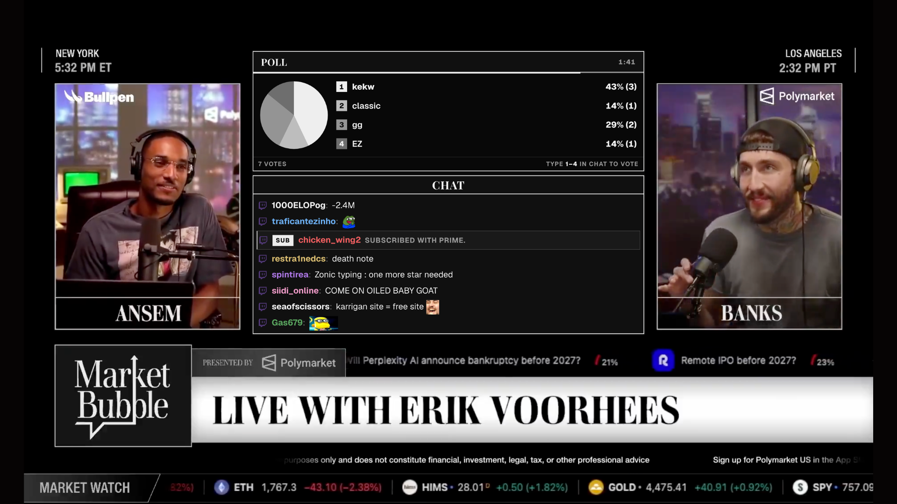
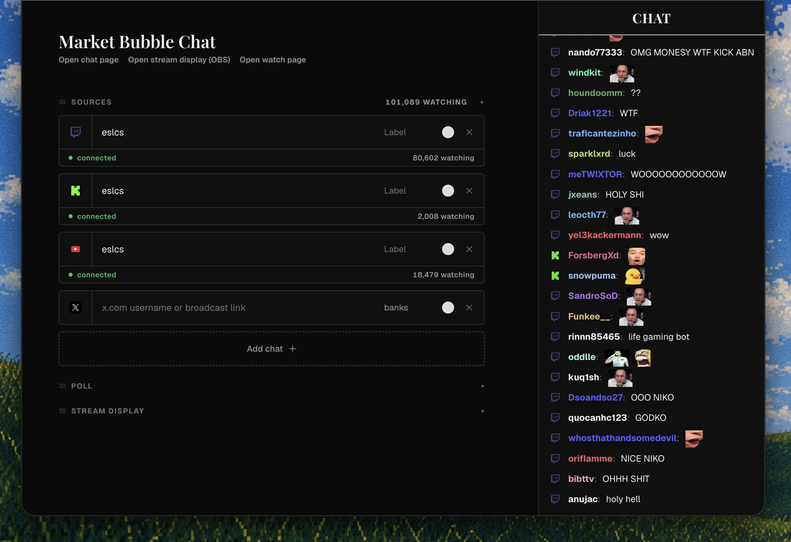
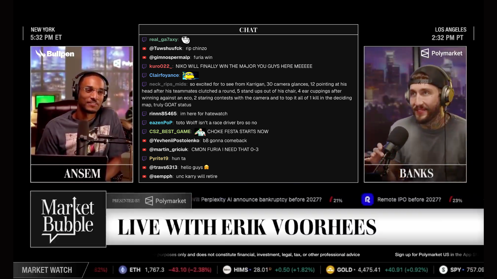
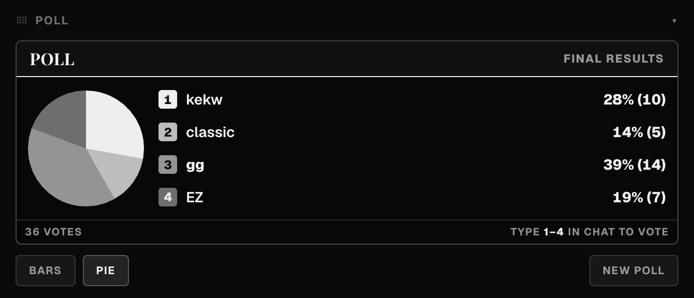
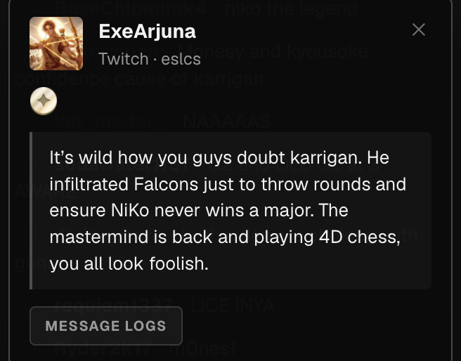
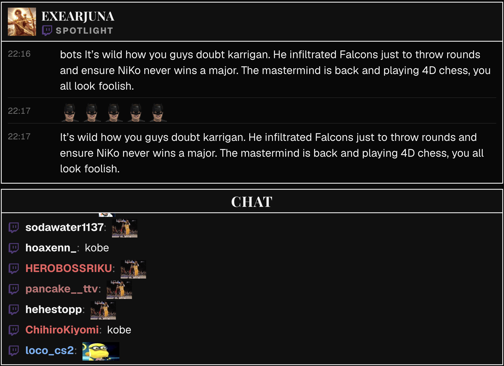
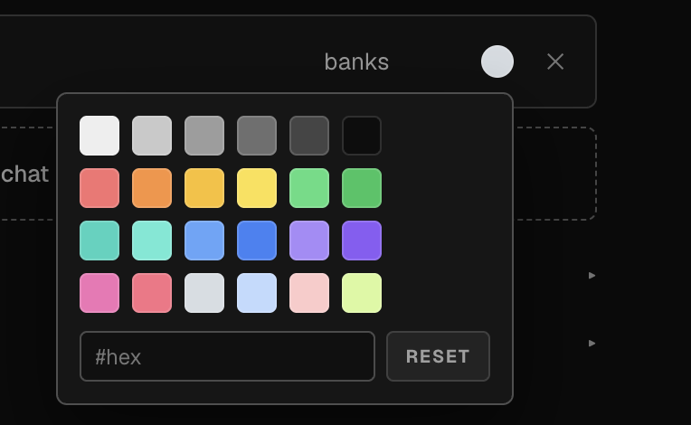
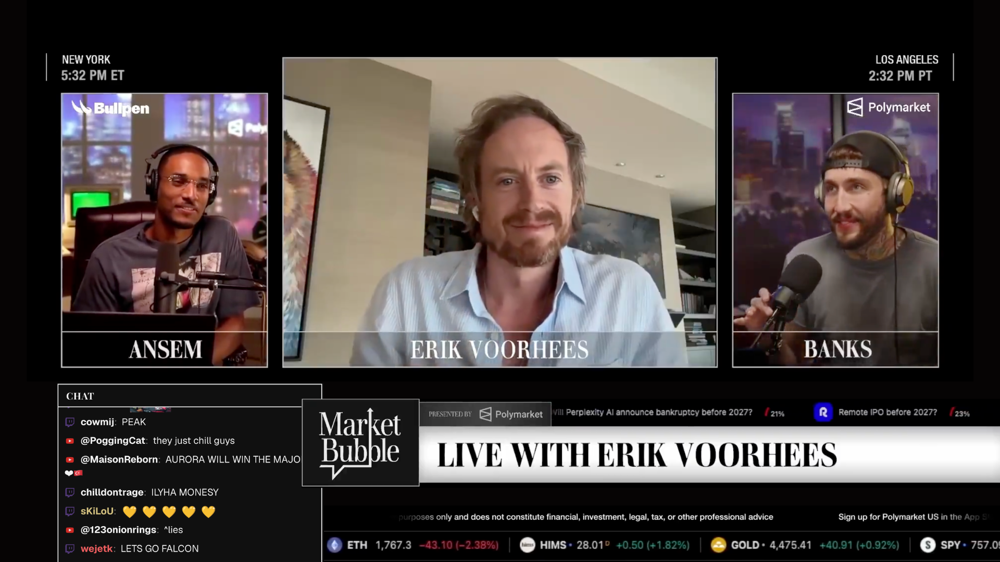
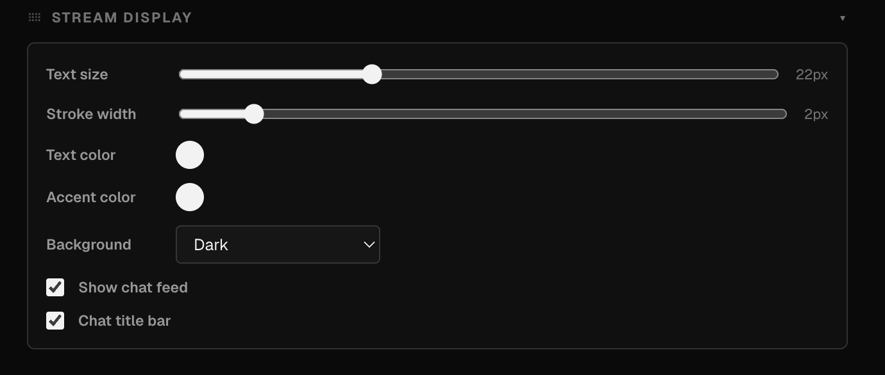

# mbchat

**One chat for every platform you stream on.**

mbchat is a self-hosted livestream chat aggregator: it merges live chat from **Twitch**, **Kick**, **YouTube**, and **X** into a single real-time feed, runs **cross-platform polls** that viewers vote on by just typing in their own chat, and ships an **OBS-ready stream overlay** whose look is controlled live from an admin panel.



| Route | What it is |
|---|---|
| `/` | Admin panel — sources, polls, spotlight, stream display styling |
| `/chat` | Public combined chat page (`?embed=1` for a frameless read-only embed) |
| `/obschat` | Stream display for OBS browser sources |
| `/watch` | Minimal watch page — player with the combined chat beside it |

```bash
npm install
npm start
# http://localhost:4173
```


---

## 1. Cross-platform chat

Four platforms, one feed, in real time:

- **Twitch** — anonymous IRC over WebSocket, with badge art and 7TV/BTTV/FFZ emotes
- **Kick** — chatroom WebSocket; keeps working even when the channel is offline
- **YouTube** — live chat polling, drip-fed so messages flow in one by one instead of in chunks
- **X** — live broadcast chat

Every source shows a live connection state and its own **viewer count**, with a combined total across all platforms in the header. Messages carry their platform's icon so you always know where a message came from. Connections self-heal — drops reconnect automatically.



## 2. Cross-chat polls

Start a poll from the admin panel and **every connected chat votes together**:

- Viewers vote by typing the option **number** or the option's **text** — case-insensitive, anywhere in their message
- One vote per user per platform; messages that match more than one option are ignored as ambiguous
- Live-animated **bar chart or pie chart**, switchable mid-poll
- Optional countdown timer with a draining time track
- The poll renders everywhere at once: admin panel, public chat page, and the OBS overlay



## 3. Chat logs

Every message is kept per user (up to 5,000 per source, in memory):

- Click any message to open that user's **full message history**, timestamped, oldest to newest
- Click another message while a log is open to jump straight to that user
- Logs power the spotlight feature — pin a user's history on stream

## 4. User info

Click a chatter and get a clean popup card right where you clicked:

- **Profile picture** (resolved live from Twitch/Kick), display name linking to their channel
- Their **platform badges as real badge art** — subscriber, moderator, founder, etc.
- The clicked message, quick access to their logs, and a **Spotlight** button



## 5. Viewer spotlight

Put a chatter on stream with one click:

- Hit **Spotlight** on any user and their name, avatar, and full message history appear on the OBS overlay instantly
- Messages are timestamped and keep updating live while the user is spotlighted
- **Streamer-synced scrolling** — scroll the spotlight in the admin panel and every viewer's spotlight scrolls with you
- The admin panel shows a live preview of exactly what viewers see, with a stop button



## 6. Tags & chat coloring

Make a busy multi-channel feed readable at a glance:

- Per-source **labels** — tag each connected chat (e.g. "main", "co-stream") and the tag rides along on every message
- Per-source **username colors** via a custom color picker
- Platform events — **subs, gift subs, super chats, memberships, bits** — render as styled event cards with uppercase tags, separated from regular chat



## 7. OBS integration

`/obschat` is built to be dropped into OBS as a browser source:

- **Transparent or dark background** — overlay it on gameplay or use it as a panel
- Polls and spotlights appear on stream automatically the moment you start them
- Chat title bar with an on/off toggle
- Every styling change made in the admin panel **pushes to OBS live** — no refresh needed



## 8. Customisability

The whole stream display is styled from the admin panel, live:

- **Text size** and **frame stroke width** sliders
- **Text and accent colors** with a custom picker — palette, hex input, reset
- Background mode, chat on/off, title bar on/off
- The admin panel itself is rearrangeable: every section **drags to reorder and collapses**, and your layout is remembered



---

## Notes

- Sources are configured in the admin panel and live in server memory — re-add them after a restart
- Kick API access goes through a headless Chromium (Playwright) to get past Cloudflare; the first Kick lookup may take a few seconds
- The live event stream is served on a second port (`PORT + 1`) so long-lived connections never block page loads
